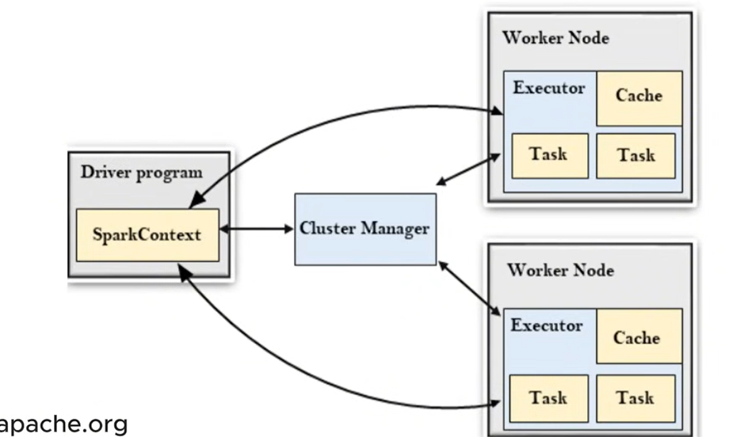
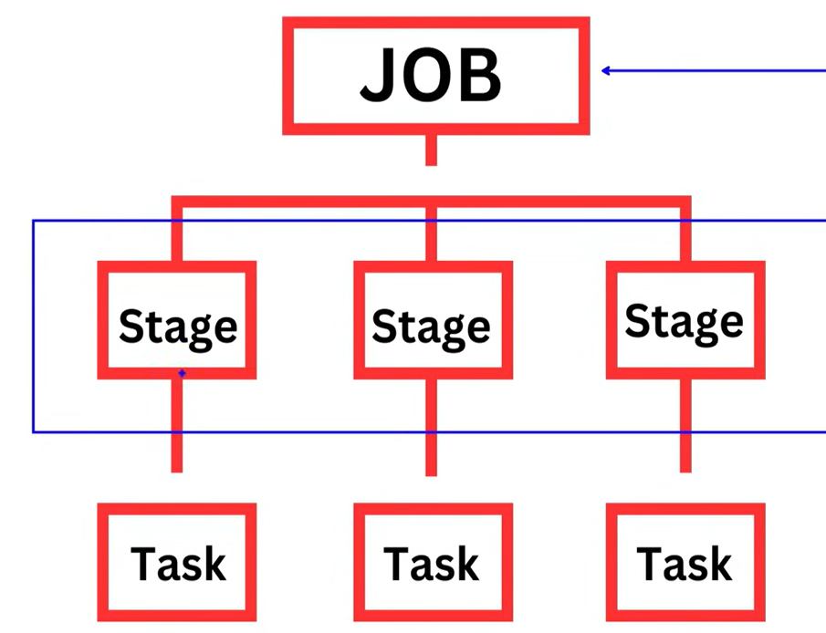

waht is spark - distributed computing data engine, grp of computers acting as cluster

driver progrm - will brk down program to diff task and create sparksession
Divides the job into stages and tasks.

cluster manager - will create worker nodes based on information
Allocates resources to Spark applications
Standalone (built-in Spark cluster manager

worker node - will process our data
Communicate results back to the Driver

driver is master, cluter and worker are slave
its a master-slave architecture

benefits - inmemory computation advantage over hadoop

lazy evalutaion -   it will create a logical plan for all transformation before performing it

The DAG Scheduler in Spark optimizes execution by breaking a job into stages and tasks.

Stages: Each Spark job is divided into multiple stages based on shuffle operations.
Tasks: Each stage is further divided into tasks that run in parallel on executors.

What is RDD?
RDD stands for Resilient Distributed Dataset. It is the fundamental data structure in Spark and represents an immutable collection of objects that can be processed in parallel across a cluster.

data = [1, 2, 3, 4, 5]
spark = SparkSession.builder.appName("RDDExample").getOrCreate()
rdd = spark.sparkContext.parallelize(data)

RDD Operations
RDD has two types of operations:

Transformations – Create a new RDD from an existing one. (Lazy evaluation)
Actions – Trigger computations and return a result.

### pySpark RDD Transformations

| Transformation | Description | Example |
|--------------|-------------|---------|
| `map()` | Applies a function to each element | `rdd.map(lambda x: x*2)` |
| `filter()` | Filters elements based on a condition | `rdd.filter(lambda x: x > 2)` |
| `flatMap()` | Similar to `map()`, but flattens the output | `rdd.flatMap(lambda x: x.split(" "))` |
| `distinct()` | Removes duplicate values | `rdd.distinct()` |
| `union()` | Combines two RDDs | `rdd1.union(rdd2)` |

### PySpark RDD Actions

| Action     | Description                          | Example                          |
|-----------|----------------------------------|--------------------------------|
| `collect()` | Returns all elements of the RDD  | `rdd.collect()`               |
| `count()`   | Returns the number of elements   | `rdd.count()`                 |
| `first()`   | Returns the first element        | `rdd.first()`                 |
| `take(n)`   | Returns the first `n` elements  | `rdd.take(3)`                 |
| `reduce()`  | Performs an operation on elements | `rdd.reduce(lambda a, b: a + b)` |

Using cache()
rdd.cache()  # Stores RDD in memory
Faster but data may be lost if memory runs out.

 Using persist()
from pyspark import StorageLevel
rdd.persist(StorageLevel.MEMORY_AND_DISK)  # Stores RDD in memory & disk
More flexible than cache().

What is a DataFrame?
A DataFrame in Spark is similar to a table in a relational database or a pandas DataFrame in Python. It is a distributed collection of data organized into named columns.

# RDD vs DataFrame in PySpark

| Feature        | RDD                                      | DataFrame                                      |
|---------------|----------------------------------------|------------------------------------------------|
| **Ease of Use**  | Requires manual schema definition     | Schema is automatically inferred              |
| **Performance**  | Slower due to manual optimizations   | Optimized via Catalyst optimizer              |
| **Query Support** | No built-in query language         | Supports SQL queries                          |
| **Storage**      | Unstructured                        | Columnar storage (Parquet, ORC) for efficiency |

# Selecting & Filtering Data in PySpark DataFrame

| Method      | Description                         | Example                               |
|------------|-------------------------------------|---------------------------------------|
| `select()`  | Selects specific columns          | `df.select("Name").show()`           |
| `filter()`  | Filters rows based on a condition | `df.filter(df.Age > 25).show()`       |
| `where()`   | Alternative to `filter()`         | `df.where(df.Age < 30).show()`        |
| `distinct()`| Returns distinct rows             | `df.select("Age").distinct().show()` |

# Writing Data in PySpark DataFrame

| Format  | Method               | Example                                      |
|---------|----------------------|----------------------------------------------|
| **CSV**    | `df.write.csv()`      | `df.write.csv("output.csv", header=True)`   |
| **JSON**   | `df.write.json()`     | `df.write.json("output.json")`              |
| **Parquet**| `df.write.parquet()`  | `df.write.parquet("output.parquet")`        |

What is Spark SQL?
Spark SQL is a module in Apache Spark that allows you to interact with structured data using SQL queries. It provides a programmatic interface and SQL-like query language for processing data.

